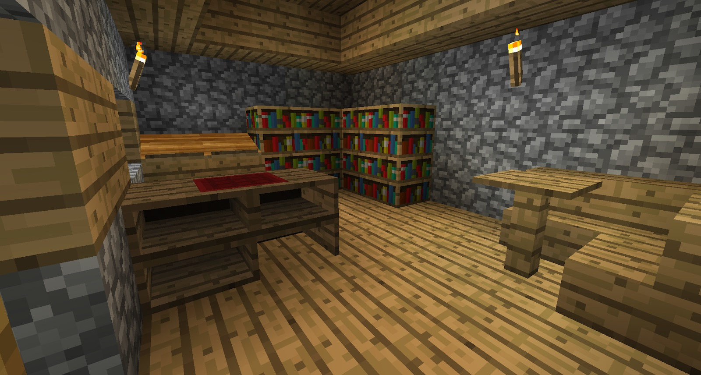

These villagers can be found within the Mystcraft house in some villages. These villagers will sell you Pages, and will also sell you Sealed Notebooks. These notebooks hold a variety of random pages (about 20 different pages), and will be key when building up your collection of pages.

The house can also contain a few pages in the Lecterns, although there might not always be pages in there.

