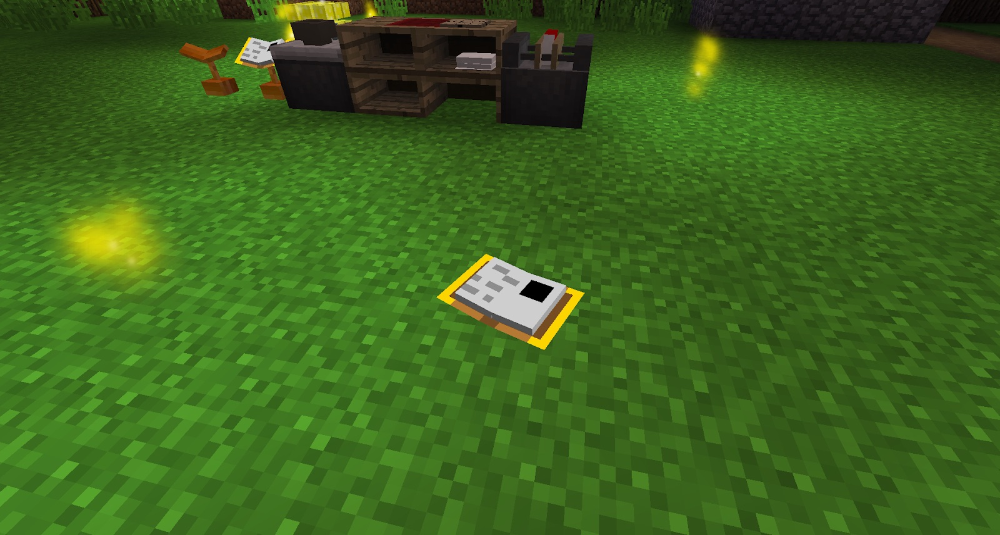

It's very important to note that when you use a Linking Book or a Descriptive Book, you will automatically drop the book in your current dimension, and then be teleported to the new dimension.

When books drop on the floor, they will slowly take damage. Rain or water will do more damage, and lava will instantly destroy the book. Books can be picked back up by sneak-right-clicking the book.

The Book Stand and the Lectern are capable of holding books, enabling you to right-click them without the risk of books dropping on the floor. Placing a book on a Stand/Lectern also protects it from hostile elements, such as rainfall.
