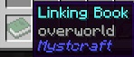

Linking Books are VERY important. They are used to get you back to the Overworld, and can also be used to travel to different locations within any dimension. Unlinked Linking Books can be crafted with one piece of leather and a Link Panel Page. This will give you a grey Unlinked book. In order to bind this book to a dimension, right-click it while it is in your hand. This turns it into a green Linking Book.

The Linking Book will remember where you stood and in what direction you were facing when you created it (right-clicked a grey Unlinked Book). By default, the Linking Book only allows you to travel between dimensions. You need to take one of these Linking Books with you to whatever dimension you travel to in order to get back. Hovering your cursor over the Linking Book will tell you what world it is linked to:

Traveling to other dimensions without a Linking Book could result in you being stuck in whatever dimension you travel to.