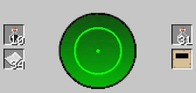
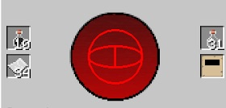
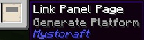

By default, the Linking Book will only take you to a different dimension. Meaning you can’t use it to teleport to a location in the dimension you are currently in. Luckily, you can modify the ink you use in the Ink Mixer when creating Linking Panels, to modify how the book behaves.

In the Ink Mixer, add ender pearls directly to the ink. This will make the ink change colour, from Black (No Effects) to Red (Disarm). This will then change again from Red (Disarm) to cycling Red and Green (Disarm+ Intra-Linking). 

The more materials you add, the higher the chance for an Intra-Linking effect to be added.

If you pull out the Panel with the Disarm effect Linking Page and use it to create a book, when you teleport, it will disarm you of all your items. 

If you pull a page out with the Intra-Linking effect, the book you create with it will allow you to teleport within the same dimension (like a village that is 1000 blocks away, or your home base).

You can double-check what kind of page you have by hovering over the Linking Panel:

 

Adding clay to the ink will turn the Ink Well Grey, adding the Generate Platform effect. This will ensure that, regardless of what happens to the world, this book will always generate a 1x1x1 platform under the spawn location.

