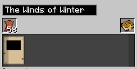

Now that you know how important it is to carry a Linking Book and how to ensure your books don't get destroyed by rain or water, you can start creating worlds and start looking for Pages.

Your first few descriptive books will be random Ages with random modifiers. The whole point of the first few Ages is just so you can collect pages, enabling you to slowly customise each Age you write. 

To create your first Descriptive book, you need a Linking Panel, Leather and a Book Binder. In the top box of the Book Binder, name your book. In the square below, add leather, and in the long box at the bottom, add the Linking Panel. This is the minimum for creating a Descriptive Book.

