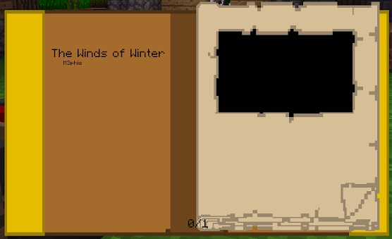
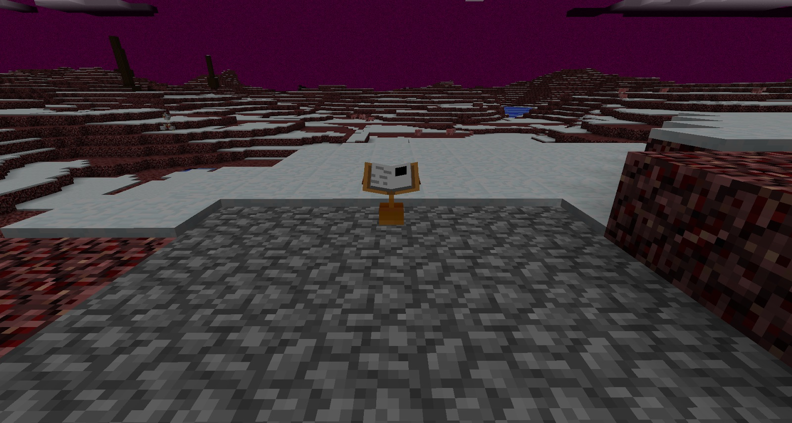

Once you have done the above, take the Descriptive Book from the right side of the Book Binder. When hovering over your book, you can see its name. When you right-click the book in hand, you can see the name and the author of the book on the left, and on the right, a big black rectangle, which is the Linking Panel:

There is only 1 page in this book, but in the future, you will be able to add more pages, and you will be able to flip through the book to see what pages have been added (handy if you are looking to copy someone else's book).

>>> You can’t currently edit books that have already been written. Once an Age book is made in the Book Binder, it cannot be edited.

Clicking this black panel on the right will transport you to the new Age. Before you transport yourself to the new Age, put the Descriptive Book into a Book Stand, take a spare Book Stand with you, as well as a Linking Book (you can always take extra). This way, when you spawn in the Age, you can put down a Book Stand and put a return Linking Book onto it straight away before you go exploring:

Welcome to your first Age. You may notice a few strange things about this new dimension. Remember that each Descriptive Book you create with just a Linking Panel (and no other pages) will have completely random properties, and possibly, instability.
