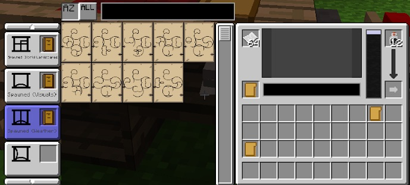

Now that you have visited a few Ages (and hopefully have started collecting a bunch of pages), you will notice that these pages are all different, and are either a biome, a colour or even a block type. Trying to store these pages can be a bit of a nightmare, and trying to organise them can be even more of a headache.

Luckily, you can craft Symbol Portfolios to organise all of you pages, and a Writing Desk so you can store all of your Portfolios and Folders.

There are 12 different kinds of pages:

* Biome Distributions
	* Huge, Large, Tiny, Tiled
* Celestials
	* Dark stars, Normal Sun, Twinkling Stars
* Effects
	* Meteors, Lightning, Random Explosions
* Lighting
	* Bright, Dark, Normal Lighting
* Modifiers Basic
	* Double Length, Zero Length, Rising Phase
* Modifiers Biomes
	* Every Biome Type
* Modifiers Blocks
	* Several Terrain, Ore and Resource blocks (including liquids)
* Modifiers Colours
	* 16 Minecraft Colours
* World Features
	* Villages, Ravines, Strongholds
* World Landscapes
	* Flat, Void, Cave
* Visuals
	* Cloud, Water, Foliage Colours
* Weather
	* Rain, Snow, Fast Weather, Eternal Weather

This is a great and easy way to organise your pages. Once you have made these 12 Portfolios, put them into the Writing Desk. When you open the Writing Desk, you can use the slots on the left to store your Portfolios, then, when you find a new page, you can file it away with similar pages. You can fill the table with Pages and Ink. The bottom left (on the right-hand side of the table) can be filled with a Folder:

You can use these Folders to create a world. If you place pages into the Book Binder, it will consume the page once the book has been written. With the help of Folders, you can copy pages (meaning you will not lose them). First, add a Blank Linking Panel, then right-click the pages you wish to add to the Folder.  

Once you have selected and copied all the pages you wish to have in your book, transfer the Folder into the Book Press, and then name and create your book.

You can reuse the Folder as all the pages are emptied into the book.