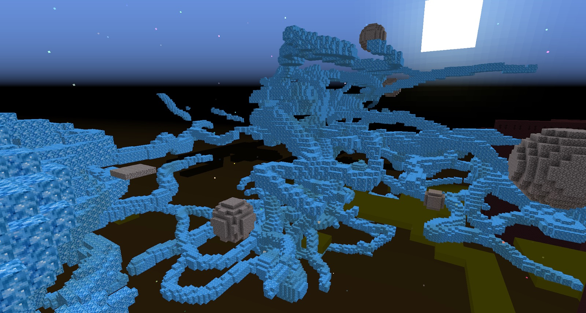

Now that you can write random Ages, it would be best to explore these Ages and find libraries so you can start collecting some of the many pages that enable you to write your own custom Ages.

Some of the worlds you create might be too unstable to be worth keeping. Other dimensions can be great for mining certain ores or minerals.

Before you start tinkering with writing Ages, it is advisable to find an Age that has Crystals growing in it, **OR** find the Crystal Block modifier page and the Tendril page (or any other feature page that accepts the Crystal Block Page).

Add the Tendrils page and the Crystal page to the Book Press (along with a Linking Panel Page) and go into a world like this:

The world might look different for you, and might be unstable. Being unstable is unimportant, but what is important is these Crystal blocks. Harvest as many of these as possible. These will come in handy.