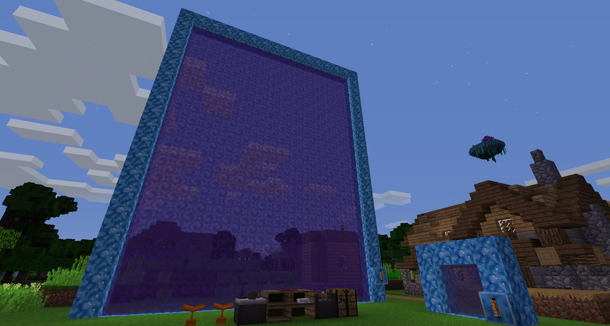
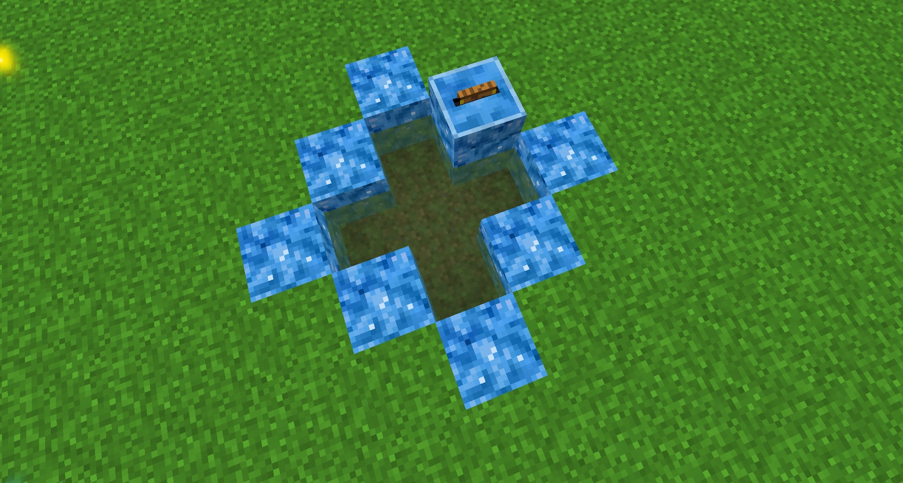

Clicking on books to teleport to different locations, such as in the Nether or the End, can be made much easier with a portal. Instead of clicking on a book, you could walk through a portal and end up at the location in the book. 

First, get a good supply of Crystals and craft (with the Crystals) a book receptacle. This is used to house whatever book you want to use for the portal. Attach this to the portal frame and right-click the book into it. Sneak-right-click to remove it. Next, build a portal. This can be any shape and any size, so go wild. You need to visit the world first, before it will work with a portal:

These portals can also be horizontal:

These portals work just like a Nether Portal, but use the location of the inserted Linking Book or Descriptive Books.

When creating books that you specifically want to use with portals, you can add a Feather to the ink. This will turn the circle blue (instead of black) and will enable anyone or anything going through a portal to not lose momentum (this is similar to how Portals function in Ichun’s Portal mod, based on the [Portal](https://en.wikipedia.org/wiki/Portal_(series)) series).