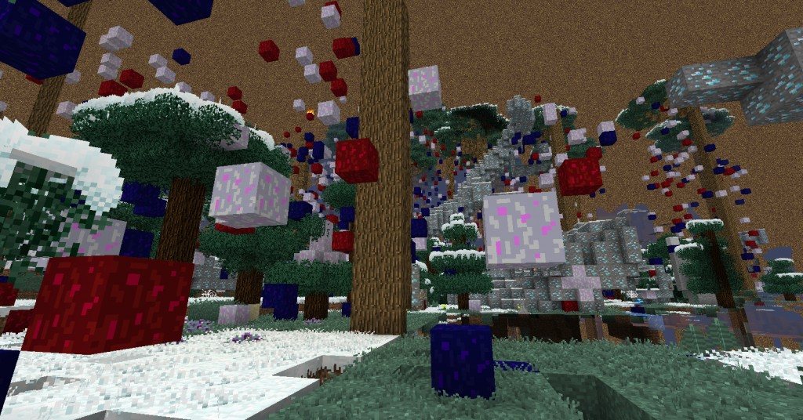

When you start creating and exploring random Ages, (or poorly written Ages), you will notice that some will contain meteors that fall from the sky, or you will have a constant negative debuff such as hunger, or mining fatigue.

Instability is the result of poor or greedy writing of Descriptive Books. Instability can bring about the end of an Age depending on its severity. 

There are many different types of instability:

* Meteors
	* Giant boulders that fly from the sky that can kill you and can completely destroy the world over time. When these land, there is a chance of ore spawning around the impact area.
* Explosions
	* Seemingly random explosions will occur. These explosions will damage a player and cause knockback, but will not break blocks.
* Negative potion effects
	* These effects will be persistent while you are in the dimension. Some of these effects will disappear when you go underground or have a solid block above you (sky exposure, therefore glass blocks do not count as a “solid block”), and others will be persistent no matter what (ambient).
		* Mining Fatigue II-IV, ambient
		* Slowness II-IV, sky exposure/ambient
		* Poison III, sky exposure
		* Nausea II-III, sky exposure
		* Hunger III, sky exposure
		* Blindness I, ambient
		* Weakness I, sky exposure
* Scorched Surface
	* Exposure to the sky can cause entities to be set on fire. Fire typically lasts around 5 seconds and may spread. The fire does 4-5 damage to mobs, but less than half of heart of damage to a player with no armor, repeatedly over time.
* Erosion
	* "Crumble" will cause blocks to break down. Diamond ore will turn into coal ore. Smooth stone will turn into cobblestone. Gravel will turn into sand. Etc.
		* Given enough time, this will result in a world that is entirely sand.
		* In the most extreme form, bedrock will also erode, and the outcome will be a void world.
* Decay
	* There are 5 different types of decay blocks. These blocks all behave differently. It can be controlled, but never completely removed from a world.
		* Black Decay
			* Time to break with diamond pick: approx. 1.5 seconds.
			* Speed: Low.
			* Unique feature: Causes ground to collapse: when two blocks form on top of each other, they will merge into one block of decay and cause every block above it to fall, even blocks that are normally unaffected by gravity.
			* Possibly the most benign form of Decay, especially to Skylands or Void worlds. It mostly spreads to existing blocks, and it spreads faster up and down than it does to the sides. It can be blown up with TNT.
		* Blue Decay
			* Time to break with diamond pick: approx. 2 seconds.
			* Speed: Medium.
			* Unique feature: None.
			* Blue decay travels moderately fast in all directions. It can travel through air, but moves around 5X slower than through existing blocks. It can be blown up with TNT.
		* Red Decay
			* Time to break with diamond pick: approx. 3 seconds.
			* Speed: Medium.
			* Unique feature: None.
			* Similar to Blue Decay, but harder to clean up. It can be blown up with TNT.
		* Purple Decay
			* Time to break with diamond pick: approx. 10 seconds.
			* Speed: Medium.
			* Unique feature: Spreads through air just as fast as the ground.
			* It breaks around as fast as obsidian, and behaves similarly to Blue and Red Decay, but without the speed penalty while traveling through air. It's nothing special if you are on the ground, but if you are in the air, it's even worse than the feared White Decay. It has an 85% chance to spawn in a Dense Ores World. It can NOT be blown up with TNT.
		* White Decay
			* Time to break with diamond pick: approx. 10 seconds.
			* Speed: fast.
			* Unique feature: Can damage player.
			* White Decay is a death sentence for an Age. It acts like Red and Blue decay, but eats through the ground much quicker. It also eats through other forms of decay as other blocks, and slowly grows into the air. It is also the only decay that can physically harm the player. It deals an armor-penetrating half-heart of damage per second, but only if the player is moving. It can NOT be blown up with TNT.

Above are examples of Red, Blue and White decay blocks appearing in an Age with Diamond Ore Tendrils, which are very likely to have caused the instability due to greedy writing or poor luck in a randomly generated Age.
