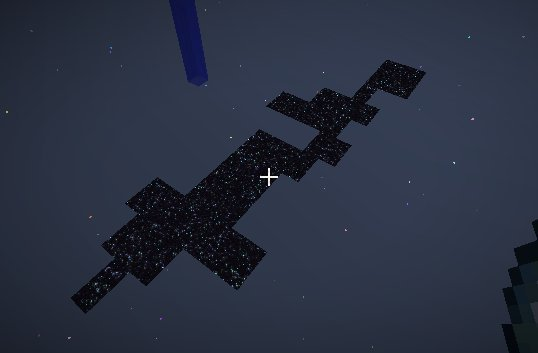
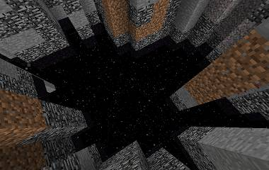

As you explore more and more Ages, you will find more and more pages. You can also find pages by trading with villagers. Most pages are obvious to what their effects are, but there are a handful of pages that are not too obvious, unless you try them out. Below are some of the more obscure pages:

##### Star Fissures
Star fissures occur randomly in ages that do not have defined “Small Feature” pages. These are generally found within 4 chunks of the Dimension spawn. You can jump down these and be teleported back to the Overworld. You will spawn close to the initial spawn point.

##### Tendrils
Tendrils are huge structures that can be made of anything, depending on the page, and can span many blocks. These are generally found above ground but extend into the terrain as well:

##### Spheres 
Creates spheres of various sizes above ground that can be made of any block (depending on page):

##### Gradients
Can be used to create to create a color shifting effect over time for some visuals like sky color or sunsets.

Gradients can be used to change Sunset, Stars, Sky, Night Sky, Fog, and Cloud color.

* Example format with three alternating colors in the sky:
	* Color Pages, Length Pages, Gradient Page (Color 1)
	* Color Pages, Length Pages, Gradient Page (Color 2)
	* Color Pages, Length Pages, Gradient Page (Color 3)
* Sky Color Page

* Length determines how long a color will last before it's completely faded to the next color. 

* Color page mixing uses standard Mystcraft rules. You must have at least two colors to alternate between, but you may add as many as needed.

